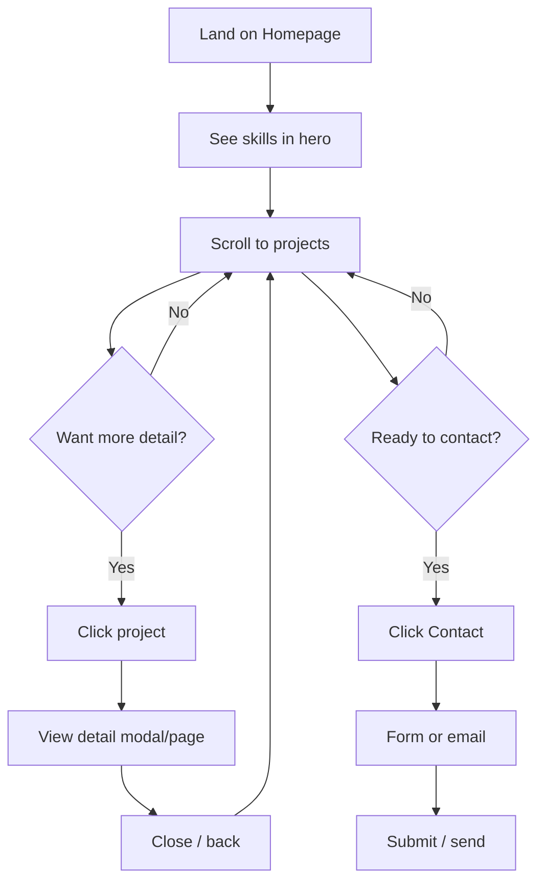
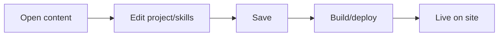

# UX Design Specification WhosWillWeb

**Author:** Will
**Date:** 2026-01-04

---

## Executive Summary

### Project Vision

WhosWillWeb is a modern portfolio website designed to showcase mobile app development work, experiences, and expertise. The platform serves as a professional showcase that makes it easier for recruiters, potential clients, and networking contacts to discover, evaluate, and connect with your work.

**Key Vision Elements:**
- Modern, professional design that reflects technical skills
- Apple-style scroll animations (simplified for MVP, enhanced in Phase 2)
- Two-phase approach: Web portfolio (Week 1) → Native mobile app (This Month)
- SEO-optimized for "mobile app developer" + your name
- Fast, accessible, and responsive across all devices

**Success Goals:**
- Visitors understand core skills within 30 seconds
- Visitors view 3+ projects to get a complete picture
- 2-3 job/freelance inquiries per month

### Target Users

**Primary User Types:**

1. **Recruiters and Hiring Managers**
   - Problem: Finding qualified mobile developers quickly
   - Need: Quick assessment of skills and experience
   - Tech-savvy level: Varies (some technical, some not)
   - Device: Desktop and mobile during work hours

2. **Potential Freelance Clients**
   - Problem: Assessing if developer can solve their project needs
   - Need: Evidence of relevant experience and capabilities
   - Tech-savvy level: Varies
   - Device: Desktop and mobile

3. **Fellow Developers**
   - Problem: Understanding technical approach for collaboration
   - Need: Access to code, technical details, project approach
   - Tech-savvy level: Highly technical
   - Device: Mobile (on-the-go) and desktop

4. **Portfolio Owner (You)**
   - Need: Easy content management and updates
   - Device: Desktop primarily

### Key Design Challenges

1. **30-Second Understanding Goal**
   - Challenge: Communicate core skills (Swift, Kotlin, React Native, AI-assisted coding) immediately on homepage
   - Solution: Clear visual hierarchy, prominent skills display, minimal cognitive load

2. **Apple-Style Scroll Animations**
   - Challenge: Balance visual appeal with performance (60fps), accessibility (prefers-reduced-motion), and fast load times
   - Solution: Simplified animations for MVP, performance-optimized techniques, graceful degradation

3. **Multiple User Types with Different Needs**
   - Challenge: Serve recruiters, clients, and developers effectively despite varying technical levels
   - Solution: Clear information architecture, progressive disclosure, multiple entry points

4. **Mobile-First Responsive Design**
   - Challenge: Ensure excellent experience across all devices, especially for on-the-go viewing
   - Solution: Mobile-first approach, touch-friendly interactions, responsive breakpoints

5. **SEO and Modern Design Balance**
   - Challenge: Optimize for search while maintaining modern, engaging visual experience
   - Solution: Semantic HTML, structured data, performance optimization, content-first approach

### Design Opportunities

1. **Design as Showcase**
   - Opportunity: The UI itself demonstrates technical capability and attention to detail
   - Impact: Creates memorable first impression, builds credibility

2. **Easy Project Discovery**
   - Opportunity: Make it effortless to view 3+ projects to meet success threshold
   - Impact: Increases engagement, improves conversion to contact

3. **Clear Skill Communication**
   - Opportunity: Use visual hierarchy and design patterns to highlight skills quickly
   - Impact: Achieves 30-second understanding goal, improves user success

4. **Professional Yet Approachable**
   - Opportunity: Stand out from typical portfolios with modern, polished design
   - Impact: Differentiates from competitors, attracts opportunities

5. **Future Interactive Demos**
   - Opportunity: Phase 2 interactive elements create unique value proposition
   - Impact: Goes beyond static portfolios, demonstrates working code

## Core User Experience

### Defining Experience

**Core User Action:**
The primary user journey is a three-step flow:
1. **Reading profile and projects** — Understanding your skills and viewing your work
2. **Understanding skills quickly** — Immediate comprehension of capabilities (30-second goal)
3. **Contacting you** — Easy, frictionless way to reach out

**Experience Flow:**
- **Entry:** User lands on homepage
- **Discovery:** Skills visible immediately, projects accessible
- **Exploration:** Smooth scrolling through projects
- **Action:** Contact mechanism easily accessible

**Core Loop:**
The essential interaction pattern is: **See Skills → Browse Projects → Contact**

### Platform Strategy

**Primary Platforms:**
- **Web (Phase 1):** Multi-Page Application (MPA) with responsive design
- **Mobile App (Phase 2):** Native iOS and Android applications

**Interaction Methods:**
- **Touch-based:** Primary for mobile devices (swipe, tap, scroll)
- **Mouse/Keyboard:** Primary for desktop (click, hover, scroll)
- **Hybrid:** Responsive design supports both interaction methods seamlessly

**Platform-Specific Considerations:**
- **Web:** Browser compatibility, SEO optimization, fast loading
- **Mobile App:** Native gestures, offline capability (Phase 2), push notifications (Phase 2)
- **Cross-platform consistency:** Shared design language and experience principles

**Device Capabilities:**
- **MVP:** Responsive web design, touch and mouse support
- **Phase 2:** Native device features (camera, sensors for interactive demos)

### Effortless Interactions

**Natural, Zero-Thought Actions:**
1. **Understanding skills at a glance** — Skills immediately visible on homepage, no searching required
2. **Scrolling through projects** — Smooth, intuitive project browsing with minimal friction
3. **Smooth scroll animations** — Apple-style animations that feel natural and enhance rather than distract

**Pain Points Addressed:**
- **Hard to find skills quickly** → Skills prominently displayed on homepage
- **Difficult to see project details** → Clear project cards with easy access to details
- **Unclear navigation** → Intuitive navigation structure

**Delightful Interactions:**
- **Smooth scroll animations** — Content reveals as user scrolls, creating engaging experience
- **Quick project browsing** — Multiple projects viewable without page reloads
- **Instant skill recognition** — Visual hierarchy makes skills immediately apparent

**Automatic Behaviors:**
- Skills visible immediately on page load
- Projects load smoothly as user scrolls
- Navigation remains accessible throughout experience
- Contact information always within reach

### Critical Success Moments

**"This is Better" Moments:**
1. **30-second skill understanding** — User immediately sees Swift, Kotlin, React Native, AI-assisted coding
2. **Effortless project browsing** — User can view 3+ projects smoothly without friction
3. **Easy contact access** — User finds contact method without searching

**User Success Feelings:**
- **Understanding capabilities** — "I know what this developer can do"
- **Finding relevant experience** — "I see projects similar to what I need"
- **Easy connection** — "I can contact them without hassle"

**Make-or-Break Interactions:**
- **Homepage skills display** — If skills aren't clear immediately, user may leave
- **Project showcase** — If projects are hard to view, user won't get complete picture
- **Contact mechanism** — If contact is difficult, user won't convert to inquiry

**First-Time User Success:**
- User lands on homepage → Sees skills immediately (within 30 seconds)
- User scrolls or navigates → Views multiple projects effortlessly
- User decides to contact → Finds contact method easily and initiates communication

### Experience Principles

**1. Instant Clarity**
- Skills visible immediately; no hunting required
- Visual hierarchy guides attention to most important information
- Minimal cognitive load to understand capabilities

**2. Effortless Exploration**
- Smooth scrolling through projects with minimal friction
- Clear project information accessible without deep navigation
- Natural flow from skills → projects → contact

**3. Progressive Engagement**
- Each step (skills → projects → contact) feels natural and builds on previous
- No dead ends or confusing navigation
- Clear path to desired action

**4. Mobile-First Delight**
- Smooth animations and interactions work beautifully on all devices
- Touch-friendly interactions with appropriate target sizes
- Performance optimized for mobile networks and devices

**5. Professional Polish**
- Design quality demonstrates technical capability
- Attention to detail builds credibility
- Modern aesthetic stands out from typical portfolios

## Desired Emotional Response

### Primary Emotional Goals

**Core Emotional States:**
1. **Confident** — Users quickly understand your capabilities and feel confident in their assessment
   - Users know what you can do within 30 seconds
   - Clear understanding of skills and experience
   - No confusion or uncertainty about capabilities

2. **Impressed** — Users are impressed by the modern design and technical quality
   - Design quality demonstrates technical capability
   - Attention to detail builds credibility
   - Stands out from typical portfolios

3. **Efficient** — Users feel they can quickly evaluate fit without wasted time
   - Fast understanding of capabilities
   - Easy navigation and project browsing
   - Quick path to contact

**Emotional Differentiation:**
- Professional yet approachable (not intimidating)
- Modern and polished (not generic)
- Efficient and clear (not confusing)

### Emotional Journey Mapping

**First Discovery:**
- **Feeling:** Curious and interested
- **Trigger:** Landing on homepage, seeing modern design
- **Design Support:** Engaging visual design, clear value proposition

**During Core Experience:**
- **Feeling:** Confident and efficient
- **Trigger:** Understanding skills quickly, browsing projects smoothly
- **Design Support:** Clear information hierarchy, smooth interactions

**After Completing Task:**
- **Feeling:** Satisfied and ready to contact
- **Trigger:** Having enough information to make decision
- **Design Support:** Easy contact access, clear next steps

**If Something Goes Wrong:**
- **Feeling:** Supported (not frustrated)
- **Trigger:** Errors, slow loading, or confusion
- **Design Support:** Clear error messages, easy recovery paths, helpful guidance

**Returning:**
- **Feeling:** Familiar and comfortable
- **Trigger:** Revisiting the portfolio
- **Design Support:** Consistent design language, familiar navigation

### Micro-Emotions

**Critical Emotional States:**

1. **Confidence (not Confusion)**
   - Users immediately understand skills and capabilities
   - Clear project information accessible without searching
   - No ambiguity about what you can do

2. **Trust (not Skepticism)**
   - Professional design quality builds credibility
   - Attention to detail demonstrates capability
   - Modern aesthetic suggests technical competence

3. **Efficiency (not Frustration)**
   - Quick understanding without wasted time
   - Smooth navigation and interactions
   - Fast loading and responsive design

4. **Delight (not Just Satisfaction)**
   - Smooth scroll animations create pleasant surprises
   - Modern interactions feel polished
   - Design quality exceeds expectations

**Emotions to Avoid:**
- **Confusion** — Unclear skills or navigation
- **Frustration** — Slow loading or difficult interactions
- **Skepticism** — Unprofessional design or poor quality
- **Overwhelm** — Too much information or cluttered design

### Design Implications

**Confidence → UX Design Choices:**
- Clear visual hierarchy guides attention to skills
- Prominent skills display on homepage (30-second goal)
- Easy project access with clear information
- Intuitive navigation structure

**Trust → UX Design Choices:**
- Professional design quality throughout
- Attention to detail in interactions and animations
- Polished, modern aesthetic
- Consistent design language

**Efficiency → UX Design Choices:**
- Fast page loading (< 2 seconds)
- Smooth animations (60fps performance)
- Intuitive navigation (minimal clicks to goals)
- Clear information architecture

**Delight → UX Design Choices:**
- Smooth scroll animations that enhance experience
- Modern interactions that feel polished
- Pleasant surprises (subtle animations, micro-interactions)
- Design quality that exceeds typical portfolios

**Emotion-Design Connections:**
- **Confidence** → Clear visual hierarchy, prominent skills, easy navigation
- **Trust** → Professional design, attention to detail, polished interactions
- **Efficiency** → Fast loading, smooth animations, intuitive flow
- **Delight** → Engaging animations, modern interactions, quality design

### Emotional Design Principles

**1. Clarity Builds Confidence**
- Every design decision should reduce confusion
- Visual hierarchy guides users naturally
- Information is accessible, not hidden

**2. Quality Builds Trust**
- Design quality demonstrates technical capability
- Attention to detail shows professionalism
- Polished interactions build credibility

**3. Speed Builds Efficiency**
- Fast loading creates positive first impression
- Smooth interactions feel effortless
- Quick understanding saves user time

**4. Polish Creates Delight**
- Smooth animations enhance rather than distract
- Modern interactions feel sophisticated
- Design quality exceeds expectations

**5. Consistency Builds Comfort**
- Familiar patterns reduce cognitive load
- Consistent design language creates trust
- Predictable interactions build confidence

## UX Pattern Analysis & Inspiration

### Inspiring Products Analysis

**Apple Website - Primary Inspiration**

**Core UX Strengths:**
- **Smooth scroll animations** — Content reveals elegantly as user scrolls, creating engaging experience
- **Click to pop up details** — Modal/overlay interactions for focused detail views
- **Multiple pages with toolbar on top** — Persistent navigation with clear page structure
- **Clean, minimal design** — Generous whitespace and high-quality imagery
- **Smooth, 60fps performance** — Animations feel natural and polished

**What Makes It Effective:**
- **Visual hierarchy** — Clear focus on key content
- **Progressive disclosure** — Information revealed as needed
- **Consistent navigation** — Easy movement between sections
- **Professional polish** — Attention to detail builds credibility

**UX Patterns to Extract:**
1. **Scroll-triggered animations** — Content appears smoothly as user scrolls
2. **Modal interactions** — Click to view details in focused overlay
3. **Persistent navigation** — Top toolbar remains accessible throughout
4. **Minimal design language** — Clean, uncluttered interface
5. **Smooth transitions** — Seamless page navigation

### Transferable UX Patterns

**Navigation Patterns:**

1. **Persistent Top Toolbar**
   - **Pattern:** Navigation toolbar stays visible at top of page
   - **Application:** Home, Projects, Contact navigation always accessible
   - **Benefit:** Supports easy navigation between sections, maintains context

2. **Sticky Header**
   - **Pattern:** Header remains visible while scrolling
   - **Application:** Navigation and contact access always within reach
   - **Benefit:** Supports effortless exploration without losing navigation

3. **Clear Page Structure**
   - **Pattern:** Each page has distinct purpose and content organization
   - **Application:** Home (skills), Projects (showcase), Contact (form)
   - **Benefit:** Supports instant clarity and reduces cognitive load

**Interaction Patterns:**

1. **Smooth Scroll Reveals**
   - **Pattern:** Content appears as user scrolls down page
   - **Application:** Projects reveal smoothly on Projects page, skills visible on scroll
   - **Benefit:** Supports effortless exploration and creates delight

2. **Modal Project Details**
   - **Pattern:** Click project to see details in overlay/modal
   - **Application:** Click project card to view full details without leaving page
   - **Benefit:** Maintains context, easy to browse multiple projects

3. **Smooth Page Transitions**
   - **Pattern:** Navigation between pages feels seamless
   - **Application:** Transitions between Home, Projects, Contact feel polished
   - **Benefit:** Supports professional polish and efficiency

**Visual Patterns:**

1. **Clean, Minimal Design**
   - **Pattern:** Generous whitespace, uncluttered interface
   - **Application:** Skills and projects displayed with breathing room
   - **Benefit:** Supports professional aesthetic and instant clarity

2. **High-Quality Imagery**
   - **Pattern:** Crisp, professional images and visuals
   - **Application:** Project screenshots and visuals showcase quality
   - **Benefit:** Builds trust and credibility

3. **Consistent Design Language**
   - **Pattern:** Unified visual style across all pages
   - **Application:** Same design system for Home, Projects, Contact
   - **Benefit:** Supports consistency and builds comfort

### Anti-Patterns to Avoid

**Performance Anti-Patterns:**
- **Overly complex animations** — Can slow down experience or distract from content
- **Heavy animations on low-end devices** — Must degrade gracefully
- **Slow loading** — Animations must not compromise initial page load

**Navigation Anti-Patterns:**
- **Hidden navigation** — Users need clear access to all pages
- **Buried contact information** — Contact must be easily accessible
- **Confusing page structure** — Each page must have clear purpose

**Interaction Anti-Patterns:**
- **Too many pop-ups** — Can interrupt flow (use modals strategically)
- **Hard-to-dismiss modals** — Must be easy to close and return to browsing
- **Unclear click targets** — Project cards and buttons must be obvious

**Content Anti-Patterns:**
- **Product-focused layout** — Adapt Apple's style to portfolio content (skills, projects)
- **Too much information at once** — Progressive disclosure is key
- **Generic portfolio design** — Must stand out while using proven patterns

### Design Inspiration Strategy

**What to Adopt:**
- **Smooth scroll animations** — Supports effortless exploration and delight
- **Persistent top toolbar** — Supports easy navigation between Home, Projects, Contact
- **Modal project details** — Supports viewing project details without losing context
- **Clean, minimal design** — Supports professional aesthetic and instant clarity

**What to Adapt:**
- **Simplified animations for MVP** — Start with basic scroll reveals, enhance in Phase 2
- **Portfolio-specific content** — Adapt Apple's visual style to showcase skills and projects
- **Contact-focused** — Ensure contact is always accessible (not hidden like Apple's support)

**What to Avoid:**
- **Overly complex animations** — Don't sacrifice performance for visual effects
- **Hidden navigation** — Keep navigation always visible
- **Product-focused layout** — Adapt to portfolio content (skills, projects, contact)

**Implementation Priority:**

**MVP (Week 1):**
- Persistent top toolbar with navigation
- Basic scroll reveals (simplified)
- Clean, minimal design
- Modal project details (if time permits, otherwise simple navigation)

**Phase 2 (This Month):**
- Enhanced scroll animations (full Apple-style)
- Smooth page transitions
- Advanced modal interactions
- Polished micro-interactions

## Design System Foundation

### Design System Choice

**Tailwind CSS** — Utility-first CSS framework as the primary design system foundation.

**Supporting libraries (as needed):**
- **Headless UI** or **Radix UI** — Accessible, unstyled components for modals, focus management (project detail modals)
- **Framer Motion** or **AOS** — Scroll-triggered and transition animations (Apple-style reveals)
- **Tailwind typography** (`@tailwindcss/typography`) — Prose styling for project descriptions

### Rationale for Selection

1. **Speed and timeline** — Utility classes enable fast layout and styling without leaving the template; supports Week 1 MVP.
2. **Full control over look** — No default component aesthetic; easy to achieve a custom, Apple-inspired, minimal portfolio look.
3. **Animation and performance** — Composes well with Framer Motion/Intersection Observer; animations can be tuned for 60fps and LCP.
4. **Next.js fit** — Works seamlessly with Next.js (PostCSS, purge), supports SSR and fast loads.
5. **Solo/small team** — Single, well-documented system; no heavy component library to learn or override.
6. **Responsive and accessibility** — Built-in responsive utilities and focus states; pair with semantic HTML and Headless UI/Radix for WCAG 2.1 AA.

### Implementation Approach

**Core stack:**
- **Tailwind CSS** — Spacing, typography, colors, breakpoints, transitions, responsive layout.
- **Design tokens** — Define in `tailwind.config.js`: colors, font families, spacing scale, breakpoints, animation durations.
- **Components** — Build UI as React components using Tailwind classes; reuse patterns (e.g. `Button`, `Card`, `Modal`, `Section`) without a full component library.
- **Animations** — Use Tailwind for simple transitions (opacity, transform); use Framer Motion or AOS for scroll-based and page transitions.

**Structure:**
- Global styles and tokens in Tailwind config.
- Shared components in a `/components` (or similar) folder.
- Page-level layout and sections composed from shared components and utilities.
- Modal and overlay behavior via Headless UI or Radix where needed (e.g. project detail modal).

**Performance:**
- Rely on Tailwind’s purge/content config so only used classes ship.
- Lazy-load animation libraries where possible to keep initial bundle small.

### Customization Strategy

**Brand and portfolio identity:**
- **Colors** — Define a small palette in Tailwind (e.g. primary, neutral, accent) to support a clean, professional look and contrast (WCAG AA).
- **Typography** — Set 1–2 font families (e.g. system stack or one distinctive font for headings); use Tailwind’s type scale for hierarchy.
- **Spacing and rhythm** — Use a consistent scale (Tailwind default or custom) for sections and component spacing to support “clean, minimal” and Apple-style rhythm.

**Apple-style and inspiration:**
- **Scroll reveals** — Implement via Framer Motion or AOS using Tailwind for layout; keep animation duration and easing consistent (e.g. 300–500ms, ease-out).
- **Modals** — Use Headless UI/Radix for behavior; style with Tailwind (backdrop, padding, rounded corners, shadow) to match the rest of the site.
- **Top toolbar** — Sticky header built with Tailwind (flex, padding, border, background); ensure touch targets and focus states meet NFRs.

**Extensibility:**
- Keep tokens and shared components in one place so Phase 2 (e.g. native app or new pages) can reuse the same visual language.
- Document the token set and key components in the UX spec or a short design-system doc for future reference.

## 2. Core User Experience (Defining Interaction)

### 2.1 Defining Experience

**Core interaction:** Scroll through projects.

The defining experience for WhosWillWeb is **scrolling through projects** — the moment that makes the product work is when visitors move through your work smoothly and understand what you can do. The homepage sets the stage (skills at a glance, highlighted projects); the core action is browsing those projects via scroll, with optional click-to-detail (modal). Success means: skills visible in one glance, then effortless project browsing using familiar patterns.

**One-sentence definition:**  
"Scroll through this developer's highlighted projects and understand their skills in one glance."

### 2.2 User Mental Model

**Homepage as hub:**  
Users expect the homepage to be the main hub. On the homepage, show **highlighted projects** so visitors don’t have to guess where the work lives. The mental model is: land on homepage → see who you are and what you do (skills in one glance) → see highlighted projects (on the same page or clearly linked) → scroll through projects → contact if interested.

**Expectations:**
- Homepage = summary + best work (highlighted projects)
- Projects = scrollable list or grid; click for more detail if needed
- Contact = easy to find (toolbar or clear CTA)
- No hunting for skills or projects; everything follows familiar portfolio patterns

**Confusion to avoid:**
- Hiding projects behind a separate "Projects" page without a preview on homepage can break the model. Homepage should show or clearly point to highlighted projects so scrolling-through-projects feels like the main experience.

### 2.3 Success Criteria

**For the core experience (scroll through projects + skills at a glance):**

1. **Skills visible in one glance**
   - On first view of the homepage, visitors immediately see core skills (e.g. Swift, Kotlin, React Native, AI-assisted coding).
   - No scrolling required to answer "What does this developer do?"
   - Supports the 30-second understanding goal.

2. **Highlighted projects on homepage**
   - Homepage shows a selection of highlighted projects (e.g. 2–3 featured or a clear "Projects" section with first few).
   - Visitors can start scrolling through projects from the homepage or with one click to a Projects page that continues the same mental model.

3. **Smooth scroll-through of projects**
   - Scrolling through projects feels smooth (and optionally animated).
   - Easy to view 3+ projects without friction.
   - Click to open project details (modal or page) is optional and consistent.

4. **Familiar patterns**
   - Navigation, layout, and "scroll to see more" follow established portfolio patterns so no learning is required.
   - Contact is where users expect it (e.g. toolbar, footer).

**Success indicators:**
- User sees skills without scrolling.
- User can scroll through multiple projects without getting lost.
- User can open project details and return without confusion.
- User can reach contact in one click from any point.

### 2.4 Novel UX Patterns

**Approach: Familiar patterns.**

The core experience uses **established UX patterns** that visitors already understand:
- Homepage with hero/skills + highlighted projects
- Scroll to see more content
- Top toolbar for navigation (Home, Projects, Contact)
- Optional: click project card to open details (modal or dedicated page)

**No novel interaction to teach.** Innovation is in execution (smooth scroll, clear hierarchy, Apple-style polish), not in a new interaction model. This keeps the experience fast to understand and supports the "skills in one glance" and "scroll through projects" goals.

**Proven patterns to adopt:**
- Sticky top toolbar with clear labels
- Card-based project list with scroll
- Modal or dedicated page for project detail
- Single obvious contact CTA

### 2.5 Experience Mechanics

**1. Initiation**
- **Trigger:** User lands on homepage (or clicks "Home").
- **Invitation:** Hero area shows name/title and skills at a glance; below it, a "Projects" or "Featured work" section with highlighted projects.
- **Start of core action:** User scrolls down to see projects, or clicks "Projects" in toolbar to go to a full projects page.

**2. Interaction**
- **What the user does:** Scrolls vertically through project cards/sections. Optionally clicks a project to open details (modal or page).
- **Controls:** Scroll (touch or mouse); click/tap on project card for details; toolbar to switch between Home / Projects / Contact.
- **System response:** Content reveals as user scrolls (optional animation); project detail opens in modal or new view; navigation updates as needed.

**3. Feedback**
- **Succeeding:** Skills are visible immediately; projects appear in a clear list/section; scroll feels smooth; project detail opens and closes predictably.
- **Errors:** If something fails (e.g. slow load), show clear loading or error state; keep toolbar and contact available so user can still reach out.

**4. Completion**
- **Done browsing:** User has seen enough projects (e.g. 3+) and either leaves or decides to contact.
- **Outcome:** User understands capabilities (skills + projects) and can contact easily.
- **Next:** Contact via form or email link; or return to scroll more / revisit later.

## Visual Design Foundation

### Color System

**Approach:** No existing brand guidelines; theme derived from project personality and emotional goals (confident, impressed, efficient, professional).

**Recommended direction — Clean professional (Apple-inspired):**
- **Background:** Near-white for light theme (e.g. `#fafafa` / `gray-50`), dark gray for dark sections or footer if used (e.g. `#111` / `gray-900`).
- **Primary text:** High-contrast dark (e.g. `#171717` / `gray-900`) on light; light text on dark.
- **Secondary text:** Muted but readable (e.g. `#525252` / `gray-600`) for descriptions and metadata.
- **Primary accent:** Single accent for links, buttons, and key CTAs (e.g. blue or a subtle teal/slate). Kept minimal so skills and projects stay the focus.
- **Borders / dividers:** Light neutrals (e.g. `gray-200` / `gray-300`) to separate sections without noise.

**Semantic mapping (Tailwind-friendly):**
- `primary` — main brand/accent (links, primary button, focus rings).
- `neutral` — grayscale for text, backgrounds, borders.
- `background` — page and section backgrounds.
- Optional: `success` / `error` for form feedback if needed.

**Accessibility:**
- Text on background: minimum 4.5:1 contrast (WCAG AA); aim 7:1 for body where possible.
- Interactive elements: clear focus states (e.g. 2px outline in accent or high-contrast color).
- Do not rely on color alone for meaning (pair with icons or labels).

### Typography System

**Tone:** Professional — clear, authoritative, easy to scan.

**Strategy:**
- **Primary typeface:** Sans-serif for UI and body. Options: system stack for performance and familiarity (`-apple-system, BlinkMacSystemFont, "Segoe UI", Roboto, sans-serif`), or a single web font (e.g. Inter, DM Sans) for a consistent professional look.
- **Secondary (optional):** Same family with different weight (e.g. medium for headings, regular for body); or a distinct serif only for rare accent (e.g. tagline) if desired.
- **Hierarchy:** Clear steps: one dominant hero/title, clear section headings, readable body, and small utility (labels, captions).

**Type scale (Tailwind-compatible):**
- **Hero / H1:** 1 size for name or main headline (e.g. `text-4xl`–`text-5xl`), bold.
- **Section headings (H2):** One step down (e.g. `text-2xl`–`text-3xl`), medium or bold.
- **Card/subheadings (H3):** Smaller (e.g. `text-xl`).
- **Body:** Base size 16px (Tailwind `text-base`), line-height ~1.5–1.6 for readability.
- **Small / metadata:** 14px (e.g. `text-sm`) for technologies, dates, labels.

**Line length:** Cap body and long descriptions around 65–75 characters for readability.

### Spacing & Layout Foundation

**Approach:** Apple-like — airy, generous whitespace, clear sections.

**Principles:**
- **Generous vertical rhythm:** Large padding between sections (e.g. 4–6rem or 64–96px on desktop) so each block (hero, skills, projects, contact) has room to breathe.
- **Horizontal containment:** Max-width content area (e.g. 1120px or 1280px) centered; padding on sides so content doesn’t touch viewport edges.
- **Consistent spacing scale:** Use a single base (e.g. 8px). Tailwind default scale (4, 8, 12, 16, 24, 32, 40, 48, 64, 80, 96) is sufficient; prefer larger steps between sections (e.g. `space-y-16` or `space-y-24` for sections).
- **Grid:** 12-column responsive grid for project cards and multi-column layouts; single column for narrative sections (hero, skills list, contact).

**Component spacing:**
- Between project cards: medium gap (e.g. 24–32px).
- Inside cards: comfortable padding (e.g. 24px).
- Toolbar: compact but touch-friendly (min 44px tap targets); padding 16–24px.

**Layout feel:** Spacious and minimal; avoid dense blocks of content so “skills at a glance” and “scroll through projects” stay clear.

### Accessibility Considerations

- **Color contrast:** All text and UI meet WCAG 2.1 AA (4.5:1 normal text, 3:1 large text and components).
- **Focus indicators:** Visible focus ring on all interactive elements (keyboard and programmatic focus).
- **Typography:** Minimum 16px body; scalable with user preferences; sufficient line-height and letter-spacing for readability.
- **Touch targets:** Minimum 44×44px for links and buttons, especially in toolbar and project cards.
- **Motion:** Respect `prefers-reduced-motion`; reduce or remove scroll animations when requested.

## Design Direction Decision

### Design Directions Explored

Three directions were explored in `_bmad-output/planning-artifacts/ux-design-directions.html`:

- **Direction A — Centered hero + grid:** Centered hero (name, tagline), skills as pill tags, project grid (e.g. 3 columns). Classic portfolio layout.
- **Direction B — Highlighted projects on homepage:** Toolbar, hero with skills, then "Highlighted projects" section on the same page. Aligns with "show highlighted projects on homepage" mental model.
- **Direction C — Single-column minimal:** Centered nav, one column, strong whitespace. Skills in one line, single-column project list. Emphasizes "scroll through projects" with minimal chrome.

### Chosen Direction

**Direction C — Single-column minimal.**

- Centered, minimal navigation (Home, Projects, Contact).
- One-column layout; generous whitespace; scroll-through-projects as the primary interaction.
- Skills at a glance in hero; projects as a single-column list below.
- Visual weight: very minimal, Apple-like spaciousness.

### Design Rationale

- Supports **scroll through projects** as the defining experience with minimal distraction.
- **Skills visible in one glance** via compact hero and single-line skills.
- **Familiar patterns** (single column, centered nav) with no extra layout complexity.
- Aligns with **professional** typography and **Apple-like** spacing from the visual foundation.
- Easy to implement for MVP and to enhance with scroll animations in Phase 2.

### Implementation Approach

- **Navigation:** Centered horizontal nav (Home, Projects, Contact); sticky optional.
- **Hero:** Name, short tagline, skills in one line or minimal tags.
- **Projects:** Single column of project blocks (title + description + technologies); optional click-to-open modal for details.
- **Spacing:** Use visual foundation spacing scale; large vertical gaps between sections.
- **Tailwind:** Utility-first layout (flex/grid, max-width container, typography scale); add Framer Motion or AOS for scroll reveals in Phase 2.

## User Journey Flows

### Visitor: See skills → Scroll projects → Contact

Primary flow for Recruiters, Clients, and Developers. Single-column layout (Direction C) supports this path.

**Entry:** Land on homepage (or Projects via nav).

**Steps:**
1. View hero: name, tagline, skills in one glance.
2. Scroll to project list; read titles and descriptions.
3. (Optional) Click a project to open detail (modal or inline).
4. When ready, click Contact in nav or CTA; complete form or use email link.

**Success:** User understands skills quickly, has seen 3+ projects, and can contact without friction.

### Portfolio owner: Update content

Will adds or edits projects and skills. Flow is secondary for MVP (content can be file-based or simple CMS).

**Entry:** Edit content (e.g. markdown/JSON or admin).

**Steps:**
1. Open project list or single project.
2. Edit title, description, technologies (and later images/links).
3. Save; content appears on site after build/deploy.

### Journey patterns

- **Navigation:** Single persistent nav (Home, Projects, Contact). Same on every page for Direction C.
- **Scroll as primary action:** No required clicks to see skills or first projects; scrolling drives discovery.
- **Progressive detail:** List view first; click only when user wants more (modal or project page).
- **Contact always available:** Nav link and optional CTA so contact is one click from anywhere.

### Flow optimization principles

- **Minimize steps to value:** Skills visible without scroll; first projects visible with one scroll.
- **Low cognitive load:** One column, clear headings, obvious “Contact” in nav.
- **Clear feedback:** Active nav state; modal opens/closes predictably; form validation and success message.
- **Error recovery:** Form errors inline; failed submit with retry; 404 with link back home.

## Component Strategy

### Design System Components

**Foundation (Tailwind + Headless UI):**

- **Tailwind:** No prebuilt components; use utility classes for layout, typography, color, spacing. Foundation components are patterns we build: buttons (styled with Tailwind), links, form inputs, focus rings.
- **Headless UI (or Radix):** Use for **Dialog** (project detail modal) — accessible open/close, focus trap, escape key, backdrop. No visual styling; we style with Tailwind to match Direction C.

**Coverage:** Layout and styling come from custom components built on Tailwind tokens. Headless UI covers only modal behavior.

### Custom Components

**Nav / Toolbar**

- **Purpose:** Persistent navigation (Home, Projects, Contact) so users can jump sections or reach contact from anywhere.
- **Usage:** Renders at top of every page; centered links (Direction C). Sticky optional.
- **Anatomy:** Container (flex, centered), logo/name (optional), nav links (Home, Projects, Contact).
- **States:** Default; hover; active/current page (underline or weight); focus (visible ring).
- **Accessibility:** Semantic `<nav>`, `<a>` for links; aria-current for current page; 44px min touch targets; keyboard focusable.

**Hero**

- **Purpose:** Deliver “skills at a glance” and introduce the developer.
- **Usage:** Top of homepage (and optionally Projects page). Name, short tagline, skills in one line or minimal tags.
- **Anatomy:** Heading (name), tagline (one line), skills (inline text or small tags).
- **States:** Default. Optional: subtle scroll-triggered animation (Phase 2).
- **Accessibility:** Single logical heading (h1); skills readable by screen readers; sufficient contrast.

**Project card (list item)**

- **Purpose:** One project in the single-column list; title, short description, technologies.
- **Usage:** Inside project list on homepage or Projects page. Optional: click opens detail.
- **Anatomy:** Block or card: title (h2/h3), description (paragraph), technologies (tags or line).
- **States:** Default; hover (optional subtle); focus (if clickable); optional active when modal open.
- **Accessibility:** If clickable, use `<button>` or `<a>` with clear label; focus ring.

**Project list**

- **Purpose:** Single-column list of project cards; supports “scroll through projects.”
- **Usage:** Homepage and/or Projects page. Renders multiple Project cards with spacing.
- **Anatomy:** Wrapper (max-width, padding), section heading (“Projects”), sequence of Project cards.
- **States:** Default; loading (optional skeleton); empty (message).
- **Accessibility:** List or region with heading; each card in logical order.

**Project detail (modal)**

- **Purpose:** Show full project details on click without leaving the page.
- **Usage:** User clicks a project card; modal opens with title, description, technologies, optional links (GitHub/YouTube later).
- **Anatomy:** Backdrop; panel (title, body, close control). Built with Headless UI Dialog, styled with Tailwind.
- **States:** Closed; open; focus inside; closing.
- **Accessibility:** Focus trap; Escape closes; aria-modal and role; close button and/or backdrop click; return focus to trigger on close.

**Contact form**

- **Purpose:** Let visitors send a message (MVP); alternative is email link.
- **Usage:** Contact page (and optional CTA elsewhere).
- **Anatomy:** Name, email, message (required); submit; optional success/error message.
- **States:** Default; focus; error (inline validation); submitting; success; server error.
- **Accessibility:** Labels for all inputs; error messages associated with fields; submit feedback; 44px targets.

**Page layout / container**

- **Purpose:** Consistent max-width and horizontal padding (Direction C, Apple-like spacing).
- **Usage:** Wraps main content on every page.
- **Anatomy:** Single wrapper: max-width (e.g. 1120px), centered, horizontal padding (e.g. 24–32px).
- **States:** N/A.
- **Accessibility:** Semantic `<main>` where appropriate; no accessibility-specific behavior.

### Component Implementation Strategy

- **Build custom components** with React (or Next.js components) and Tailwind; use design tokens from `tailwind.config.js` (colors, spacing, type scale).
- **Use Headless UI** only for Dialog (project modal); keep styling in Tailwind for consistency with Direction C.
- **Reuse patterns:** One Nav, one Hero, one ProjectCard, one ProjectList, one Modal, one ContactForm, one Layout so the experience stays consistent.
- **Accessibility:** Semantic HTML, ARIA where needed, keyboard support, focus management in modal, WCAG 2.1 AA contrast and targets.

### Implementation Roadmap

**Phase 1 – MVP (Week 1)**

- **Layout / Container** — Every page uses same max-width and padding.
- **Nav** — Persistent Home, Projects, Contact; supports core journeys.
- **Hero** — Skills at a glance on homepage (and optionally Projects).
- **Project list + Project card** — Single-column list; title, description, technologies. Click optional for MVP (can link to anchor or separate page first).
- **Contact form** (or email link) — Contact page; form or mailto.
- **Project detail modal** — If time: Headless UI Dialog + Tailwind; else defer to Phase 2.

**Phase 2 – Enhancement**

- **Project detail modal** — If not in MVP; optional scroll animation in Hero/Project list.
- **Refinements** — Loading states, empty states, form validation polish.

**Phase 3 – Optional**

- **Blog or extra sections** — Additional components if scope expands.

## UX Consistency Patterns

### Button Hierarchy

- **Primary:** One main action per view (e.g. “Send” on contact form). Use solid background (accent color), sufficient contrast, min 44px height. Only one primary button per section.
- **Secondary:** Nav links and “close” in modals. Text or subtle border; same min touch target. No solid fill unless hover.
- **Tertiary / link:** Inline links (e.g. “email me”). Underline or color only; focus ring on focus.
- **Consistency:** Use Tailwind classes consistently (e.g. `btn-primary`, `btn-secondary` or shared utility classes) so hierarchy is predictable.

### Feedback Patterns

- **Success:** After form submit or key action — short message near the form or in a small banner (e.g. “Message sent. I’ll get back to you soon.”). Green or neutral; auto-dismiss or static until user navigates.
- **Error:** Inline for validation (under field); for submit/server errors, message at top of form or in same region. Red or high-contrast; describe the issue and how to fix.
- **Loading:** For form submit — disable submit button and show “Sending…” or spinner. No full-page loader for single actions.
- **Accessibility:** Announce success/error to screen readers (live region or role="alert"); don’t rely on color alone.

### Form Patterns

- **Contact form:** Name, email, message (required). Labels above or associated; placeholders optional, not replacement for labels. Inline validation on blur or submit; submit disabled until valid if desired.
- **Validation:** Required fields marked (e.g. “*” or “Required”); error message under field with `aria-describedby` / `aria-invalid`. Success: clear errors and show success message.
- **Layout:** Single column; generous spacing between fields; primary button at end. Match Direction C spacing (e.g. Tailwind spacing scale).
- **Accessibility:** `<label for="id">`, `id` on inputs; group related fields in `<fieldset>` if needed; 44px min touch targets.

### Navigation Patterns

- **Global nav:** Same nav on every page — Home, Projects, Contact. Centered (Direction C); text links; `aria-current="page"` on current page.
- **Sticky (optional):** Nav can stay at top on scroll; ensure it doesn’t cover focus when tabbing. Same component everywhere.
- **Active state:** Current page visually distinct (e.g. font-weight or underline); not only color.
- **Mobile:** Same links; hamburger only if needed for space; tap targets min 44px.

### Modal and Overlay Patterns

- **Project detail modal:** Triggered by clicking a project card. Headless UI Dialog; backdrop dims page; panel centered, max-width, scrollable if content is long.
- **Close:** Close button (top-right or bottom) + Escape + click backdrop. Focus trapped inside while open; on close, focus returns to trigger.
- **Content:** Title (project name), description, technologies; optional links (GitHub/YouTube) in Phase 2.
- **Accessibility:** `role="dialog"`, `aria-modal="true"`, `aria-labelledby` for title; focus trap and return focus.

### Empty and Loading States

- **Empty projects:** If no projects yet, show one short message (e.g. “Projects coming soon.”) in the project list area; no broken layout.
- **Loading:** If project list or form is loaded async, optional skeleton (e.g. placeholder cards) or simple “Loading…” text. Prefer minimal UI so MVP can avoid loading states if content is static.
- **No search/filter in MVP:** Omit search and filter patterns until Phase 2; keep single-column list only.

### Design System Integration

- **Tailwind:** All patterns use Tailwind tokens (color, spacing, typography). Buttons, form inputs, and modals use same token set for consistency.
- **Headless UI:** Modal behavior (focus trap, Escape, backdrop) from Headless UI; visuals from Tailwind only.
- **Custom rules:** One primary button per section; nav always same; form errors always inline and associated with fields; modals always close with Escape and backdrop click.

## Responsive Design & Accessibility

### Responsive Strategy

- **Desktop:** Use extra width for comfortable reading: max-width content (e.g. 1120px) centered, generous padding. Single-column layout (Direction C) stays; no multi-column content. Nav remains centered; touch targets and spacing stay consistent.
- **Tablet:** Same layout as desktop with reduced padding if needed. Touch targets min 44px; no hover-only interactions. Single column and same nav.
- **Mobile:** Mobile-first. Single column stacks naturally; nav can stay horizontal (few links) or collapse to hamburger if space is tight. Hero and project list full-width within padding; form and modal full-width with safe padding. Prioritize “skills at a glance” and “scroll through projects” without horizontal scroll.

### Breakpoint Strategy

- **Mobile:** 320px–767px (Tailwind `sm` and below). Base styles are for this range.
- **Tablet:** 768px–1023px (Tailwind `md`). Optional padding/typography tweaks.
- **Desktop:** 1024px+ (Tailwind `lg`). Max-width container, larger section spacing.

**Approach:** Mobile-first. Use Tailwind breakpoint prefixes (`md:`, `lg:`) to add or adjust layout and spacing at larger sizes. Direction C’s single-column design needs minimal breakpoint logic.

### Accessibility Strategy

- **Target:** WCAG 2.1 Level AA.
- **Color contrast:** Text at least 4.5:1 (normal), 3:1 (large); UI components 3:1. Check with contrast checker.
- **Keyboard:** All actions available via keyboard; visible focus (e.g. 2px outline); no keyboard traps; modal focus trap and return focus.
- **Screen readers:** Semantic HTML (headings, `<nav>`, `<main>`, `<button>`/`<a>`); ARIA where needed (e.g. dialog, live regions for form feedback); images have alt text.
- **Touch targets:** Minimum 44×44px for links, buttons, and interactive cards.
- **Motion:** Respect `prefers-reduced-motion`: reduce or disable non-essential animations (scroll reveals, transitions).

### Testing Strategy

- **Responsive:** Test on real devices or emulators (e.g. iPhone, Android, tablet); Chrome DevTools device modes; multiple viewport widths. Check no horizontal scroll and readable text.
- **Accessibility:** Automated checks (e.g. axe, Lighthouse); keyboard-only pass (Tab, Enter, Escape); screen reader (e.g. VoiceOver, NVDA) for critical flows (nav, project list, contact form, modal). Spot-check contrast and focus visibility.
- **Browsers:** Chrome, Safari, Firefox, Edge (latest); iOS Safari and Chrome Mobile for touch and viewport.

### Implementation Guidelines

- **Responsive:** Prefer rem/em and Tailwind spacing; mobile-first media queries; fluid typography where helpful; avoid fixed px for tap targets (use min-height/min-width). Optimize images (sizes/srcset) for different screens.
- **Accessibility:** Use semantic elements; associate labels with inputs; provide skip link to main content; ensure focus order matches visual order; use Headless UI for modal focus behavior; test with keyboard and one screen reader before release.
